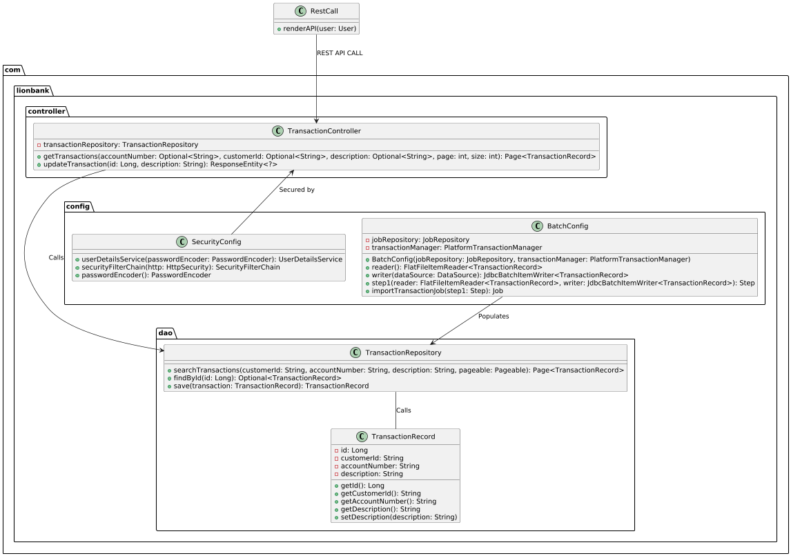
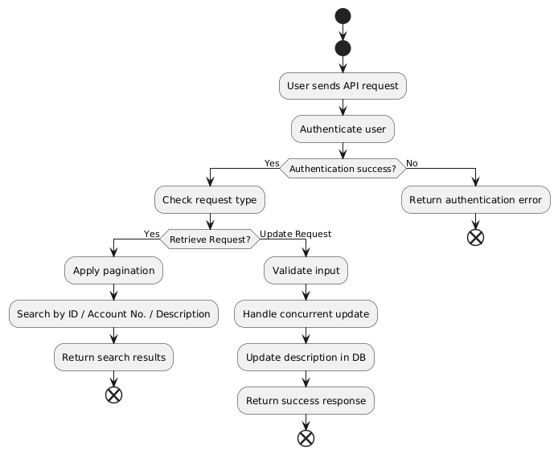
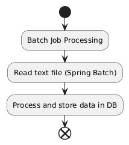

# Design Patterns Used

## Spring MVC Architecture
This project follows the **Spring MVC Pattern**, which is a widely adopted **Layered Architecture Pattern** for Spring-based applications.

### **Project Layer Structure**
- **Controller Layer (`controller` package)** - Manages incoming HTTP requests.
- **Service Layer** - Typically, business logic resides in a separate service layer. However, for simplicity, the business logic has been included in the controller. In a production-ready project, a dedicated `service` package should be created.
- **DAO Layer (`dao` package)** - Handles database interactions.
- **Configuration Layer (`config` package)** - Defines application configurations.

### **Database Schema**
- The project uses an **in-memory H2 database** for simplicity and quick prototyping.
- The datasource includes a **unique transaction identifier**.
- Since no predefined unique transaction identifier was provided, an **auto-incrementing ID** has been introduced to ensure uniqueness.

### **Code Considerations**
- This implementation represents a **Minimum Viable Product (MVP)**, prioritizing core functionality.
- Security enhancements can be incorporated later, but have been deferred due to time constraints related to the interview process.

---

# How to Run
To start the application, use the following **Maven** command:

```sh
mvn spring-boot:run -f pom.xml
```

---

# How to Test
### **Exercise 1: Update Transaction Description**
> **Note:** The transaction ID is auto-generated since the dataset did not provide a unique identifier.

```sh
curl -u lion:maybank -X PUT "http://localhost:8080/api/transactions/1" \
     -H "Content-Type: application/json" \
     -d "Updated transaction description"
```

### **Exercise 2: Query Transactions by Account Number, Customer ID, or Description**
> **Note:** This request includes all three query parameters. You can remove any two and test accordingly.

```sh
curl -u lion:maybank "http://localhost:8080/api/transactions?page=0&size=10&accountNumber=12345&customerId=67890&description=payment"
```

### CLASS DIAGRAM



### ACTIVITY DIAGRAM

#### FOR REST CALL



#### FOR BATCH PROCESS
